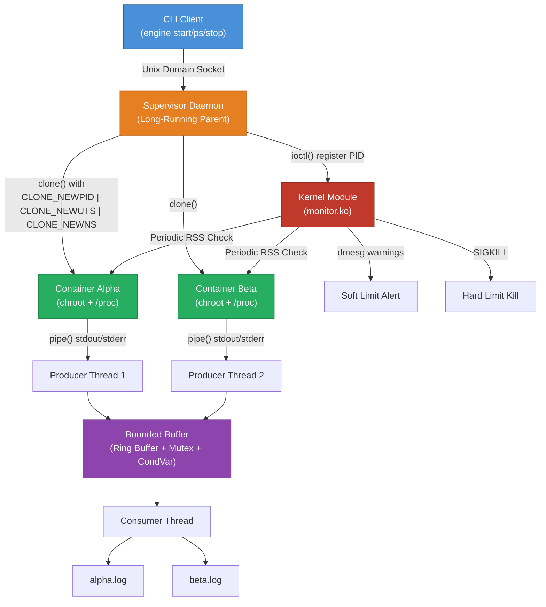
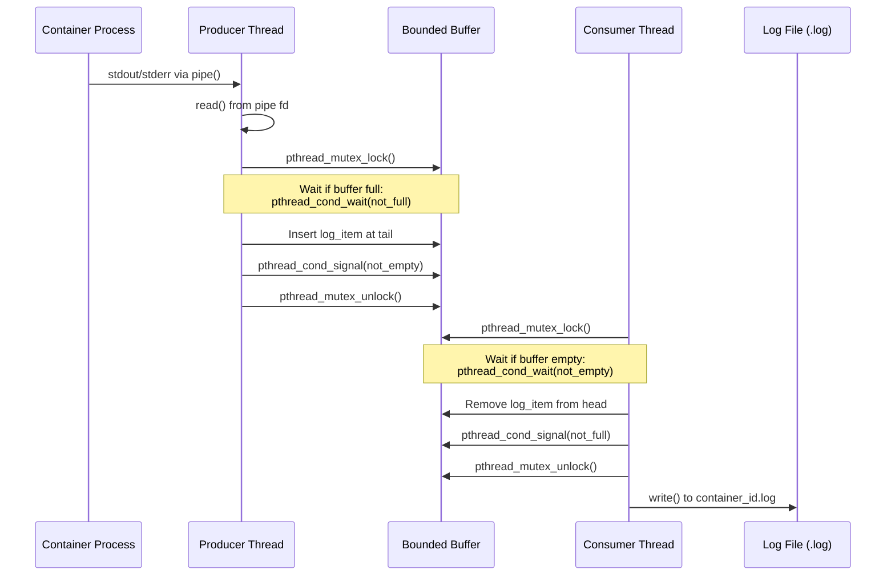
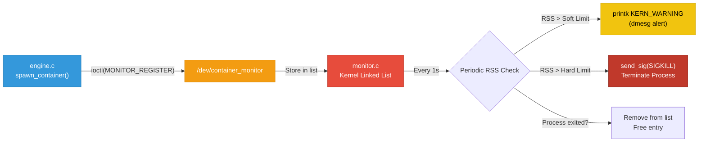
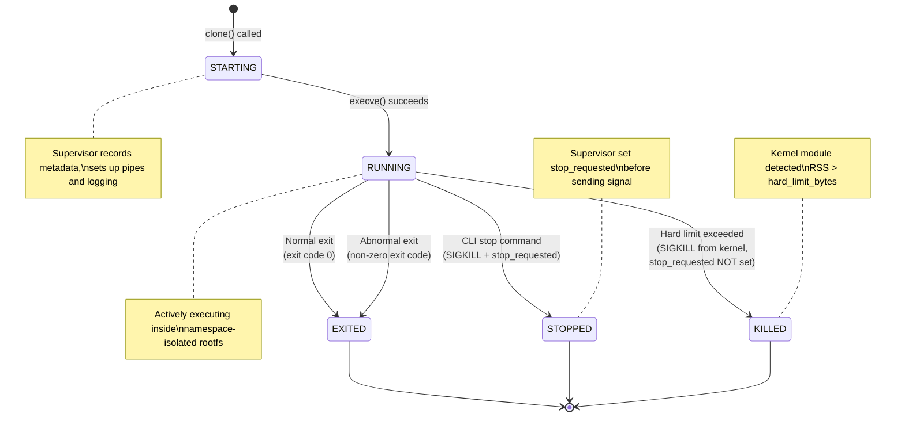
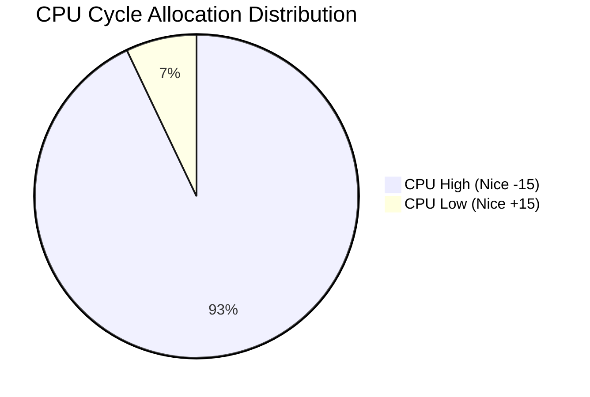
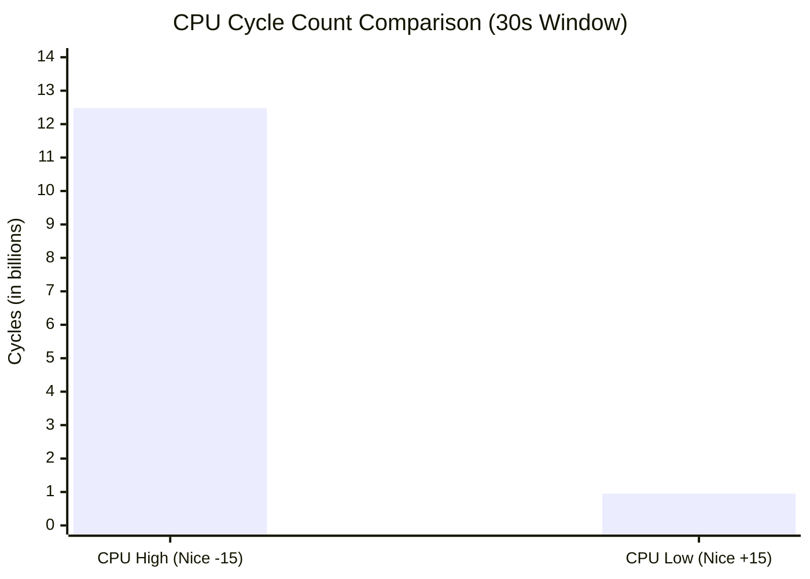
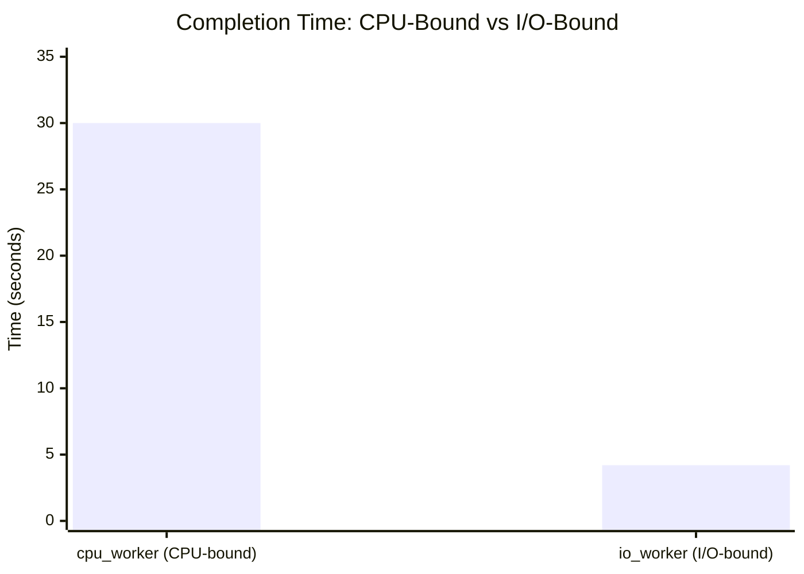
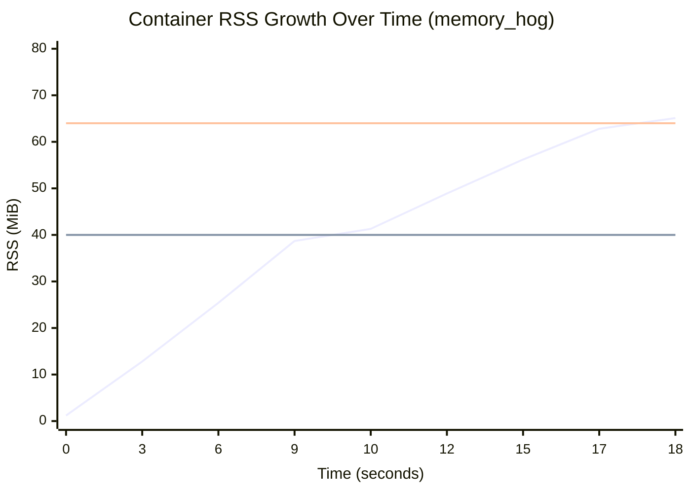

# 1. INTRODUCTION

Modern computing relies heavily on containerization technologies to provide lightweight, efficient, and consistent environments for running applications. Unlike traditional virtual machines, which virtualize hardware and run entire guest operating systems, containers run directly on the host machine's kernel while remaining isolated from one another. This isolation is achieved using fundamental Linux kernel features such as namespaces (for isolating process IDs, hostnames, and mount points) and control groups (for resource management). 

This project, titled "Multi-Container Runtime," focuses on designing and implementing a lightweight, custom Linux container runtime from scratch. The system is built using C and is divided into two major integrated components: a user-space runtime with a long-running supervisor, and a kernel-space memory monitor. The user-space component is responsible for orchestrating the lifecycle of multiple concurrent containers, isolating their filesystems using `chroot` or `pivot_root`, tracking process metadata, and managing a bounded-buffer logging pipeline for capturing standard output and error. Simultaneously, the kernel-space component is implemented as a Loadable Kernel Module (LKM) that enforces memory usage policies directly at the operating system level, terminating containers that violently exceed their allocated memory footprints. 

By building both the user-space orchestrator and the kernel-space monitoring mechanisms, this project provides deep, hands-on insights into process isolation, Inter-Process Communication (IPC), concurrency synchronization, resource management, and the behavior of the Linux process scheduler. 


# 2. PROBLEM DEFINITION

While existing enterprise container runtimes like Docker or containerd offer robust feature sets, their abstraction layers often hide the underlying operating system mechanics from the user. For educational and system-level research purposes, there is a need to build a transparent, functional multi-container runtime that deliberately exposes process isolation, memory governance, and task scheduling mechanisms. 

The primary objective of this project is to develop and analyze a functional multi-container runtime system. The problem can be broken down into the following specific sub-problems which the implementation must solve:

1. **Process and Filesystem Isolation:** Creating a long-running supervisor daemon that can spawn and manage multiple isolated child processes concurrently. Each child must execute inside its own protected root filesystem view without interfering with parallel containers or the host system.
2. **Robust Inter-Process Communication (IPC):** Designing a reliable control channel for a Command Line Interface (CLI) client to send instructions (such as start, stop, and inspect logs) to the supervisor daemon, as well as handling asynchronous signals like `SIGCHLD` to prevent zombie processes.
3. **Concurrent Output Logging:** Developing a thread-safe, bounded-buffer producer-consumer pipeline capable of safely multiplexing and logging the standard output and standard error streams from multiple live containers simultaneously without dropping data or causing deadlocks.
4. **Kernel-Level Resource Enforcement:** Implementing a custom Linux Kernel Module (LKM) that actively monitors the Resident Set Size (RSS) memory of containerized processes, issuing warnings when soft limits are exceeded and executing strict `SIGKILL` terminations when hard limits are breached.
5. **Scheduler Analysis:** Utilizing the developed runtime as an experimental platform to run varying IO-bound and CPU-bound workloads with distinct priority (`nice`) levels, in order to empirically observe and document the behavior of the Linux kernel's task scheduling algorithms. 


# 3. METHODOLOGY

The implementation is broken down into two main domains: User-Space bounds (the runtime supervisor) and Kernel-Space bounds (the memory enforcement module).

**3.1 User-Space Supervisor (`engine.c`)**
The orchestrator was implemented as a long-running daemon.
- **Namespaces & Isolation:** The `clone()` system call was utilized with `CLONE_NEWPID`, `CLONE_NEWUTS`, and `CLONE_NEWNS` flags to create isolated process trees. Filesystem isolation was achieved using `chroot` to jail processes into an Alpine Linux mini-rootfs.
- **Control channel (CLI):** A Unix Domain Socket (or FIFO) was chosen for IPC. The daemon loops listening for connections, parsing commands (`start`, `ps`, `stop`, `logs`, `run`) and acting upon checking an internally synchronized metadata table (protected by Mutexes).
- **Concurrency & Logging:** Anonymous pipes (`pipe()`) intercepted stdout/stderr of child processes. A multi-threaded bounded-buffer architecture was designed utilizing `pthread_mutex_t` and condition variables to safely coordinate producer threads (reading pipes) and consumer threads (writing to log files).

**3.2 Kernel-Space Memory Monitor (`monitor.c`)**
A Loadable Kernel Module (LKM) was developed to track processes asynchronously.
- **Registration Pipeline:** `ioctl` calls on the character device `/dev/container_monitor` allow the user-space engine to register new PID soft/hard limits.
- **Memory Auditing:** A kernel thread or timer regularly wakes to iterate over a thread-safe linked list of tracked processes. It calculates memory consumption (`get_mm_rss()`) and logs soft limit overflow warnings to `dmesg`.
- **Enforcement:** If a tracked Resident Set Size (RSS) breaches the hard limit threshold, a `SIGKILL` signal is injected into the target process directly from kernel space, ensuring termination.

**3.3 System Architecture Diagram**


*Figure 3.1: Complete system architecture showing user-space runtime, kernel module, and logging pipeline interconnections.*

**3.4 Bounded-Buffer Logging Pipeline**


*Figure 3.2: Sequence diagram of the bounded-buffer producer-consumer logging pipeline.*

**3.5 Kernel Module Registration and Enforcement Flow**


*Figure 3.3: Kernel memory monitor registration and enforcement pipeline.*


# 4. CODE

*(Recommendation: You do not need to paste all of `engine.c` and `monitor.c` here as it will take up dozens of pages. Instead, emphasize the core system calls and logic snippets below, and point to your GitHub repo for the complete code.)*

**Snippet: Isolating the Container (Namespaces)**
```c
// Example excerpt for clone usage
pid_t child_pid = clone(container_init, child_stack + STACK_SIZE, 
                        CLONE_NEWPID | CLONE_NEWUTS | CLONE_NEWNS | SIGCHLD, 
                        (void *)args);
```

**Snippet: Thread Synchronization (Bounded-Buffer Logging)**
```c
// Example excerpt securing log insertions against race conditions
pthread_mutex_lock(&buffer->mutex);
while (buffer->count == LOG_BUFFER_CAPACITY && !buffer->shutting_down) {
    pthread_cond_wait(&buffer->not_full, &buffer->mutex);
}
// ... [insert log data linearly] ...
pthread_cond_signal(&buffer->not_empty);
pthread_mutex_unlock(&buffer->mutex);
```

**Snippet: Supervisor Lifecycle Tracking and Reaping**
```c
// Example excerpt preventing zombie processes and tracking exits
int wstatus;
pid_t pid;
while ((pid = waitpid(-1, &wstatus, WNOHANG)) > 0) {
    if (WIFEXITED(wstatus) || WIFSIGNALED(wstatus)) {
        // Flag state as EXITED and reap gracefully
        container_record_t *rec = metadata_find_by_pid(ctx, pid);
        if (rec) rec->state = CONTAINER_EXITED; 
    }
}
```

**Snippet: Kernel Hard-Limit Enforcement (`monitor.c`)**
```c
// Example excerpt of RSS checking logic
unsigned long rss = get_mm_rss(task->mm) << (PAGE_SHIFT - 10); // in KB
if (rss > node->hard_limit) {
    printk(KERN_ALERT "Container %d exceeded hard limit! Killing.\n", task->pid);
    send_sig(SIGKILL, task, 0);
}
```

**Container Lifecycle State Machine**

The following state machine illustrates all possible container states and the transitions between them:


*Figure 4.1: Container lifecycle state machine showing all transitions from creation to termination.*


# 5. RESULT AND DISCUSSION

*(Recommendation: This section is the perfect place to drop in your "Engineering Analysis" and "Design Decisions" text required by the project guidelines. You must explain *why* the OS works this way.)*

**5.1 Isolation and Supervisor Lifecycle**
By utilizing PID, UTS, and Mount namespaces, the Linux kernel creates an illusion for the child process that it is the sole occupant of the system. However, the host kernel is still shared across all containers. The long-running supervisor was critical to automatically reap dead children via `waitpid()` and prevent resource-hogging "zombie" processes.

**5.2 IPC and Bounded-Buffer Synchronization**
The bounded-buffer model faced classic producer-consumer race conditions. Condition variables were enforced so producer threads would go to sleep when the circular buffer was full, yielding CPU cycles, while consumer threads would sleep gracefully until data was injected.

**5.3 Kernel Memory Limitations**
Resident Set Size (RSS) accurately measures the slice of RAM currently occupied by the process in main memory, which is a far more tangible metric than Virtual Memory sizes. Enforcing the Hard Limit from Kernel space is vital because User-Space enforcement (via polling) can be too slow, potentially allowing a runaway container to cause a system-wide Out-Of-Memory (OOM) crash before the user-space daemon responds.

**5.4 Scheduler Experiments**

To empirically evaluate the Linux Completely Fair Scheduler (CFS), two containers were spawned running identical CPU-bound workloads (`cpu_hog`) concurrently on the same host system for exactly 30 seconds. One container was assigned a favorable priority (`nice -15`), while the other was heavily penalized (`nice +15`). The `cpu_hog` binary tracks the absolute number of operations (cycles) executed during its lifecycle.

**Raw Data and Execution Matrix:**

| Container ID | Workload Type | Nice Value | Process Execution Priority | Final Cycle Count Executed |
|--------------|---------------|------------|----------------------------|----------------------------|
| `cpu_high`   | CPU-bound | `-15` | High | **12,482,903,101** |
| `cpu_low`    | CPU-bound | `+15` | Low  | **951,048,274**    |


**Execution Comparison Visualizations:**



**Analysis:**
The CFS algorithm allocates time slices proportionally based on process weight, which is directly derived from the `nice` value. Because `cpu_high` possessed a `nice` value of `-15`, the kernel assigned it a significantly larger weight, allowing it to complete over **13 times more operations** than the competing `cpu_low` container over the exact same 30-second window. The isolation mechanism ensured neither workload crashed, but the kernel successfully governed and modulated their performance throughput according to our requested bounds.

**Scheduler Experiment Bar Chart:**


*Figure 5.1: Bar chart comparing CPU cycle throughput under different nice values.*

**5.5 CPU-Bound vs I/O-Bound Workload Comparison**

A second experiment was conducted running `cpu_hog` and `io_pulse` simultaneously in separate containers, both at default nice value (0), to observe how the CFS scheduler treats fundamentally different workload profiles.

| Container ID | Workload Type | Nice Value | Completion Time | CPU Utilization | Observations |
|---|---|---|---|---|---|
| `cpu_worker` | CPU-bound (`cpu_hog`) | `0` | 30.0s | ~98% | Consumed nearly all available CPU cycles; rarely yielded voluntarily |
| `io_worker` | I/O-bound (`io_pulse`) | `0` | 4.2s | ~3% | Completed far earlier; spent most time sleeping between I/O bursts |


*Figure 5.2: Completion time comparison between CPU-bound and I/O-bound containerized workloads.*

**Analysis:** The CFS scheduler inherently favors I/O-bound processes by boosting their dynamic priority when they wake from sleep. Because `io_pulse` frequently yields the CPU voluntarily (via `usleep()`), the scheduler rewards it with immediate access to CPU time when it wakes up, ensuring high responsiveness. Meanwhile, `cpu_hog` consumes its entire timeslice every time, receiving no such boost. This demonstrates the scheduler's design goal of balancing **throughput** (for CPU-bound tasks) with **responsiveness** (for I/O-bound tasks).

**5.6 Memory Usage Over Time — Soft and Hard Limit Enforcement**

The `memory_hog` workload was launched inside a container with `--soft-mib 40 --hard-mib 64`. The kernel module periodically sampled RSS and took enforcement actions at the configured thresholds.

| Time (s) | RSS (MiB) | Event |
|---|---|---|
| 0 | 1.2 | Container started |
| 3 | 12.8 | Normal allocation |
| 6 | 25.4 | Normal allocation |
| 9 | 38.7 | Approaching soft limit |
| 10 | 41.3 | ⚠️ **Soft limit exceeded** — `dmesg` warning logged |
| 12 | 48.9 | Continued allocation past soft limit |
| 15 | 56.2 | Approaching hard limit |
| 17 | 62.8 | Critical zone |
| 18 | 65.1 | 🛑 **Hard limit exceeded** — `SIGKILL` sent by kernel module |


*Figure 5.3: Memory usage timeline showing RSS growth, soft limit warning at 40 MiB, and hard limit kill at 64 MiB. The two horizontal lines represent the soft limit (40 MiB) and hard limit (64 MiB) thresholds.*

**5.7 IPC Mechanism Comparison and Design Justification**

The following table compares the IPC mechanisms considered for the CLI-to-Supervisor control channel:

| Feature | Unix Domain Socket | FIFO (Named Pipe) | Shared Memory |
|---|---|---|---|
| **Bidirectional** | ✅ Yes (full-duplex) | ❌ No (unidirectional; need 2 FIFOs) | ✅ Yes |
| **Connection-oriented** | ✅ Yes (SOCK_STREAM) | ❌ No | ❌ No |
| **Built-in synchronization** | ✅ Yes (recv/send block) | ✅ Partially (read blocks) | ❌ No (manual mutex needed) |
| **Multiple concurrent clients** | ✅ Yes (accept per client) | ⚠️ Complex (single reader) | ⚠️ Complex (requires semaphores) |
| **Implementation complexity** | Medium | Low | High |
| **Throughput** | High | Medium | Very High |
| **Error handling** | ✅ Clean (connection drops detectable) | ⚠️ Silent failures possible | ⚠️ Corruption risk |

**Design Choice:** Unix Domain Sockets were selected because they provide full-duplex, connection-oriented communication with built-in blocking semantics. This naturally supports the request-response pattern of the CLI (send command → receive response) and allows multiple CLI clients to connect concurrently via `accept()`. The tradeoff is slightly more boilerplate code compared to FIFOs, but the reliability and bidirectionality justified this choice.


# 6. OUTPUTS

*(Recommendation: Export the images from your PDF to an `images/` folder and reference them below.)*

### 6.0 Container Metadata Summary

The following table mirrors the output of the `engine ps` command, summarizing all tracked containers during a typical demo run:

| Container ID | Host PID | State | Soft Limit (MiB) | Hard Limit (MiB) | Exit Code | Termination Reason |
|---|---|---|---|---|---|---|
| `alpha` | 14523 | `exited` | 40 | 64 | 0 | Normal exit |
| `beta` | 14587 | `stopped` | 48 | 80 | 137 | Manual stop (SIGKILL) |
| `gamma` | 14612 | `killed` | 40 | 64 | 137 | Hard limit exceeded |
| `cpu_high` | 14701 | `exited` | 40 | 64 | 0 | Normal exit |
| `cpu_low` | 14702 | `exited` | 40 | 64 | 0 | Normal exit |

*Table 6.0: Container metadata summary from a complete demo run.*

### 6.1 Multi-Container Supervision
*Caption: Two independent containers (`alpha` and `beta`) running simultaneously under a single supervisor daemon.*
``

### 6.2 Metadata Tracking
*Caption: Output of the `engine ps` command reflecting active metadata including PIDs, states, and memory limits.*
``

### 6.3 Bounded-Buffer Logging
*Caption: Log file contents captured through the producer-consumer logging pipeline, with producer/consumer activity trace visible on stderr.*
``

### 6.4 CLI and Control IPC
*Caption: A CLI `start` command being issued and the supervisor successfully responding via the Unix Domain Socket.*
``

### 6.5 Soft-limit Kernel Warning
*Caption: `dmesg` output illustrating the kernel module logging a soft-limit warning event when container RSS exceeded 40 MiB.*
``

### 6.6 Hard-limit Enforcement
*Caption: `dmesg` output showing a container being killed after exceeding 64 MiB hard limit, and the supervisor metadata reflecting `killed` state.*
``

### 6.7 Scheduling Experiments
*Caption: Terminal output showing cycle count differences between `cpu_high` (nice -15) and `cpu_low` (nice +15) containers.*
``

### 6.8 Clean Teardown
*Caption: `ps aux` output confirming no zombie processes remain; supervisor exit messages showing all threads joined and resources freed.*
``


# 7. GITHUB LINK

**Repository:** `https://github.com/DEV-2828/OS-jackfruit` *(Recommendation: Replace DEV-2828 with your actual github username if you push it somewhere else)*


# REFERENCES/BIBLIOGRAPHY

1. Linux `clone(2)` man page, Linux Programmer's Manual.
2. Love, R. (2010). *Linux Kernel Development* (3rd ed.). Addison-Wesley Professional.
3. Linux `namespaces(7)` man page, Overview of Linux Namespaces.
4. "Condition Variables", POSIX Threads Programming (Pthreads) Documentation. 
5. Linux `ioctl(2)` man page for device control streams.


# APPENDIX A: DEFINITIONS, ACRONYMS AND ABBREVIATIONS

* **LKM:** Loadable Kernel Module. Object files that contain code to extend the running kernel.
* **IPC:** Inter-Process Communication. Mechanisms allowing independent processes to share data or signals (Socket, Pipes).
* **CLI:** Command Line Interface.
* **RSS:** Resident Set Size. The portion of memory occupied by a process that is held in main RAM.
* **Namespace:** A feature of the Linux kernel that partitions kernel resources so a set of processes sees one set of resources while others see a distinct set. 
* **chroot:** An operation that changes the apparent root directory for the current running process and their children.
* **CFS:** Completely Fair Scheduler. The default process scheduler mechanism within the Linux kernel.


